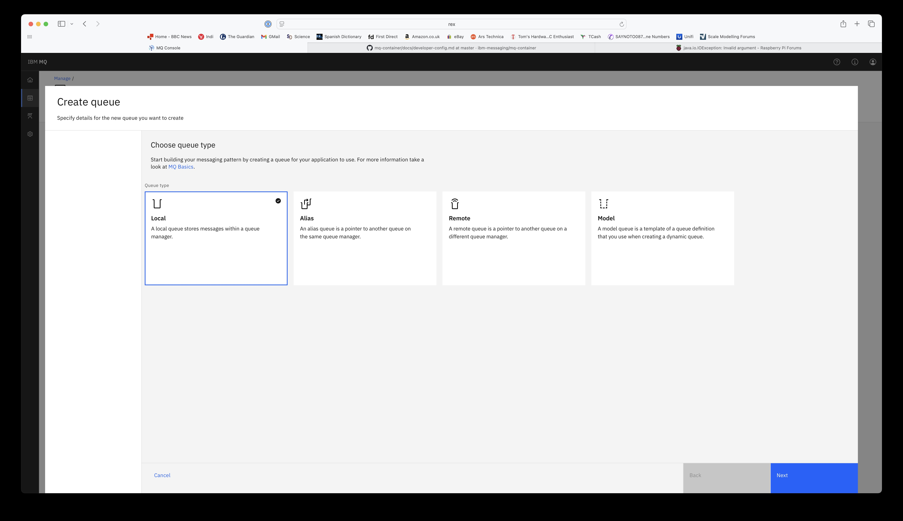

**<center>JBoss EAP 8 and IBM WMQ integration</center>**


1. Start IBM WMQ in podman container

Pull WMQ image

`podman pull icr.io/ibm-messaging/mq:latest`

Check it

`podman images`

Create the WMQ volume

`podman volume create wmqdata`

Verify that it has been created 

`podman volume ls`

Since environment variables **MQ_ADMIN_PASSWORD** and **MQ_APP_PASSWORD** have been  deprecated it is necessary to create secrets for admin user and app user passwords

`printf "quick123+" | podman secret create mqAdminPassword -`

`printf "quick123+" | podman secret create mqAppPassword -`


Start podman container

`podman run --rm --secret mqAdminPassword --secret mqAppPassword --volume wmqdata:/mnt/mqm --env LICENSE=accept --env MQ_DEV=true --env MQ_QMGR_NAME=QMGR --publish 1414:1414 --publish 9443:9443 --detach --name WMQ icr.io/ibm-messaging/mq:latest`

At this point it should be possible to login into WMQ admin console as user admin with password quick123+

`https://localhost:9443`

Once logged in select **Manage** from the left hand side options.


Create local queues that are used by the test application. Select Queue Manager then Queues and click on Create button.


select local and click on **Next**. Enter the queue name **IN.QUEUE**.
 


Edit **IN.QUEUE** configuration 


and add access for **app** user.


Grant all permissions by selecting app user and the clicking on it.


2. Start JBoss EAP server.

Download a build of Wildlfy application server from 

`https://www.wildfly.org/downloads/`

Unzip wildfly-36.0.0.Final.zip zip into a directory

```
unzip wildfly-36.0.0.Final.zip

cd wildfly-36.0.0.Final

export JBOSS_JHOME=`pwd`
```

Change directory to $JBOSS_HOME and create a wmq instance of the server

`cd $JBOSS_HOME`

`cp -rp standalone standalone-wmq`

In the project root directory 

Copy the `ejb/src/main/resources/META-INF/eap-8/standalone-full.xml` JBoss EAP config file to `$JBOSS_HOME/standalone-wmq/configuration`

`cp ejb/src/main/resources/META-INF/eap-8/standalone-full.xml $JBOSS_HOME/standalone-wmq/configuration`

If your Jboss EAP server is runing on a different server than the podman with WMQ container then you may need to edit the wmq.properires file and change the 

`wmq.host=localhost`

to the correct hostname.

Copy the `ejb/src/main/resources/META-INF/eap-8/wmq.properties` file to `$JBOSS_HOME/bin`

start JBoss EAP instance with command

`cd $JBOSS_HONE/bin`

`./standalone.sh -DuseKQueue=false -Djboss.server.base.dir=$JBOSS_HOME/standalone-wmq --server-config=standalone-full.xml  --properties=wmq.properties`

In the project home directory run

`mvn clear package`

to build project EAR file.

Deploy the project EAP fiel to JBoss EAP

`cd $JBOSS_HOME/bin`

`./jboss-cli.sh --connect`

`deploy ${path to project ear file}/jboss-as-jms-wmq-mdb-ear.ear`

Select **N.QUEUE** and put on it a test message. Then select the **OUT.QUEUE** and it should have the test message.


